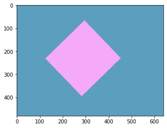
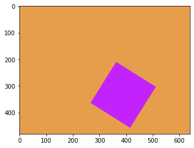
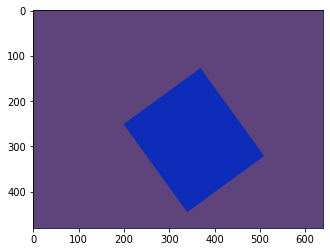
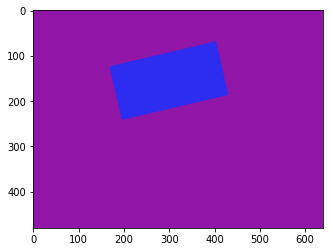
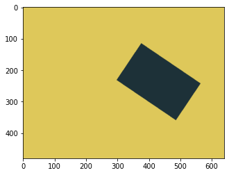

# 1. Реализовать модуль генерации данных
Реализовать на языке Python класс, один из методов которого будет создавать изображение и описание фигур, находящихся на этом изображении. Сгенерированное изображение должно быть размером 640х480 пикселей и представляет собой однотонный фон случайного цвета, на котором размещен прямоугольник случайного размера (без выхода за границы изображения) со стороной от 150 до 250 пикселей случайного цвета, отличного от цвета фона, повернутого на случайный угол от 0 до 89 градусов.  

Выход метода класса:  
1)	сгенерированное изображение;  
2)	параметры описывающего прямоугольника (координаты x, y верхнего левого угла, ширина (w) и высота (h));  
3)	координаты четырех углов сгенерированного прямоугольника.  

Листинг кода:  
```ruby
class object1:
    def ran1(self):
        self.img = np.zeros((480, 640, 3), np.uint8)
        self.img[:] = (random.randrange(0, 255), random.randrange(0, 255), random.randrange(0, 255))
        width = random.randrange(100, 250)
        height = random.randrange(100, 250)
        diam = np.sqrt(width ** 2 + height ** 2)

        x1 = random.randrange(int(diam / 2 - width / 2), int(self.img.shape[1] - (diam / 2 - width / 2) - width))
        x2 = x1 + width
        y1 = random.randrange(int((diam / 2 - height / 2)), int(self.img.shape[0] - (diam / 2 - height / 2) - height))
        y2 = y1 + height

        points = np.array([[x1, y1], [x2, y1], [x2, y2], [x1, y2]])

        ANGLE = np.deg2rad(random.randrange(0, 89))
        c_x, c_y = np.mean(points, axis=0)
        points = np.array([[c_x + np.cos(ANGLE) * (px - c_x) - np.sin(ANGLE) * (py - c_y),
                            c_y + np.sin(ANGLE) * (px - c_x) + np.cos(ANGLE) * (py - c_y)]
                           for px, py in points]).astype(int)

        self.points = points
        self.describe = np.array([points[3][0], points[0][1], points[1][0] - points[3][0], points[2][1] - points[0][1]])
        self.img = cv2.drawContours(self.img, [points], 0,
                               (random.randrange(0, 255), random.randrange(0, 255), random.randrange(0, 255)), -1)
```
Создание экземпляра:  
```ruby
image = object1()
image.ran1()
```  

## Примеры:  

1. Изображение  
  
Описывающий прямоугольник  

 x = 125  
 y = 66  
 w = 328  
 h = 328   
Координаты углов  
 x1, y1 = [125 231]  
 x2, y2 = [295  66]  
 x3, y3 = [453 229]  
 x4, y4 = [283 394]   
 
 2. Изображение  
  
Описывающий прямоугольник  

 x = 267  
 y = 210  
 w = 244  
 h = 246   
Координаты углов  
 x1, y1 = [267 363]  
 x2, y2 = [363 210]  
 x3, y3 = [511 303]  
 x4, y4 = [415 456]  
 
 3. Изображение  
  
Описывающий прямоугольник  

 x = 200  
 y = 128  
 w = 309  
 h = 316  
Координаты углов  
 x1, y1 = [200 251]  
 x2, y2 = [369 128]  
 x3, y3 = [509 321]  
 x4, y4 = [340 444]  
 
 4. Изображение  
  
Описывающий прямоугольник  

 x = 169  
 y = 69  
 w = 261  
 h = 172  
Координаты углов  
 x1, y1 = [169 124]   
 x2, y2 = [403  69]   
 x3, y3 = [430 186]   
 x4, y4 = [196 241]   
 
 5. Изображение  
  
Описывающий прямоугольник  

 x = 298  
 y = 115  
 w = 266  
 h = 243   
Координаты углов  
 x1, y1 = [298 231]  
 x2, y2 = [376 115]  
 x3, y3 = [564 242]  
 x4, y4 = [486 358] 
 
